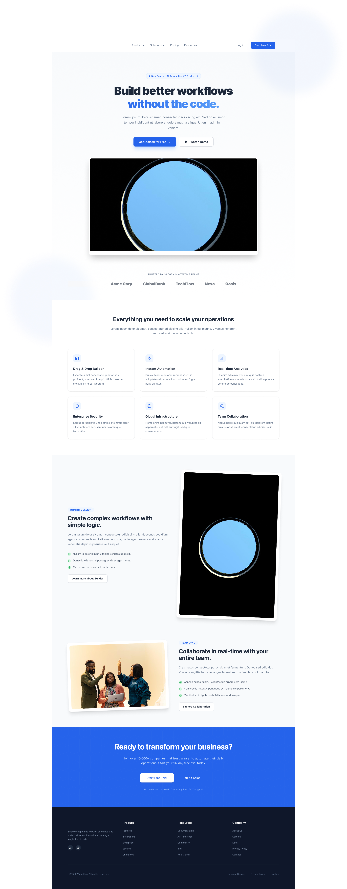

# Bitrate – No-Code AI Automation Platform

Bitrate is a modern no-code AI automation platform that enables teams to design workflows, automate repetitive processes, and scale operations efficiently — without writing code.

It combines an intuitive visual builder with AI-powered automation to help organizations improve productivity, reduce manual effort, and accelerate execution.

  

---

## Overview

Bitrate simplifies automation for modern teams. Its visual workflow builder and AI-powered automation engine enable users to create scalable, production-ready workflows without engineering complexity.

The platform is optimized for performance, collaboration, and enterprise-grade reliability.

---

## Features

- Visual drag-and-drop workflow builder  
- AI-powered automation templates  
- Real-time team collaboration  
- Enterprise-grade security architecture  
- Advanced analytics dashboard  
- No-code integrations with popular tools  
- Fully responsive, mobile-first design  
- Production-ready deployment setup  

---

## Tech Stack

**Framework**  
- Next.js 14+ (App Router)

**Styling**  
- Tailwind CSS v4  

**UI Components**  
- shadcn/ui  

**Icons**  
- Lucide React  

**Deployment**  
- Optimized for modern cloud platforms  

---

